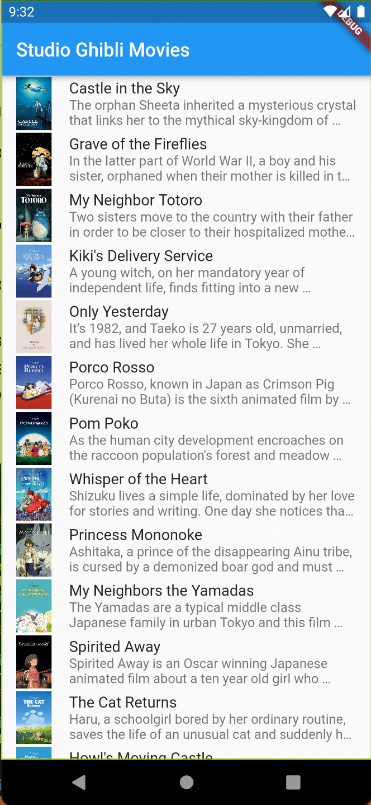
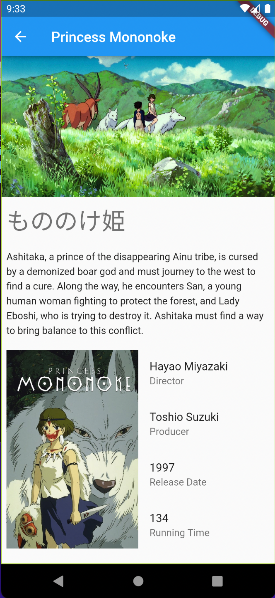

# FLUTTER SWR EXAMPLE

Test stale-while-revalidate pattern with riverpod. Look; [query_provider](/plugins/query_provider) package

- Backend calls are made with [ghibli-api](https://ghibliapi.herokuapp.com/)
- Tested Provider.family to check if state are persisted in memory.

## Screens

| Main Screen           | Movie Screen            |
| --------------------- | ----------------------- |
|  |  |

## Checklist

- [x] Riverpod setup with backend calls.
- [ ] Cache the network requests with dio http cache.
- [ ] Invalidate cache and update the data in background if new data is present.
- [ ] Add a way to invalidate and refetch the data.
